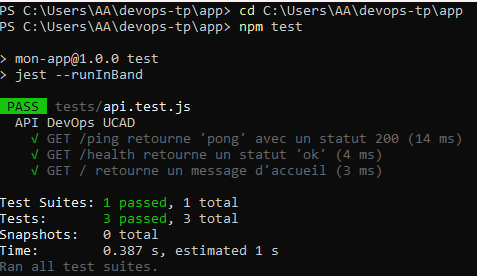
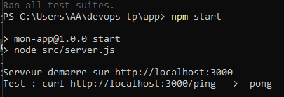
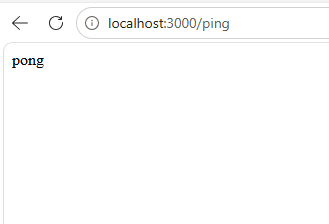

# Rapport de TP — Automatisation dans les DevOps

**Université Cheikh Anta Diop de Dakar (UCAD)**
**Département Informatique — 2025-2026**

- **Nom / Prénom :** _[Papa Ahmadou Mbow et Ramatoulaye Diallo]_
- **Date :** 03/06/2026
- **Sujet :** Automatisation d'un pipeline DevOps (scripts shell, CI/CD, IaC)

---

## Introduction

Ce TP met en œuvre l'automatisation d'un pipeline DevOps autour d'une application
Node.js / Express minimale. L'API expose une route `GET /ping` qui renvoie `pong`.
Le projet couvre les trois parties demandées :

1. **Partie 1 :** un script bash (`auto_deploy.sh`) qui automatise vérification
   des dépendances, clonage, installation, tests et démarrage de l'application.
2. **Partie 2 :** un pipeline CI/CD GitHub Actions (`.github/workflows/ci.yml`)
   déclenché à chaque push/PR sur `main`.
3. **Partie 3 :** une introduction à l'Infrastructure as Code avec Terraform
   (`terraform/main.tf`).

### Arborescence du projet

```
devops-tp/
├── app/                       # Application Node.js / Express
│   ├── src/index.js           # Définition de l'app (testable)
│   ├── src/server.js          # Démarrage du serveur HTTP
│   ├── tests/api.test.js      # Tests unitaires (Jest + Supertest)
│   ├── Dockerfile
│   └── package.json
├── auto_deploy.sh             # Partie 1 : script d'automatisation
├── .github/workflows/ci.yml   # Partie 2 : pipeline CI/CD
├── terraform/main.tf          # Partie 3 : Infrastructure as Code
├── captures/                  # Captures d'écran des exécutions
├── README.md
└── RAPPORT.md                 # Ce document
```

---

## Partie 1 — Automatisation avec un script shell

Le script `auto_deploy.sh` enchaîne automatiquement :

1. Vérification que `git`, `node` et `npm` sont installés.
2. Clonage du dépôt (ou mise à jour `git pull` s'il existe déjà).
3. Installation des dépendances (`npm install`).
4. Exécution des tests (`npm test`).
5. Démarrage de l'application **uniquement si les tests passent**.

Bonnes pratiques intégrées : `set -euo pipefail` (arrêt à la moindre erreur),
fonction utilitaire `require_cmd`, et capture explicite du code de retour des tests.

### Réponses aux questions

**Q1. Accepter l'URL du dépôt en paramètre**
L'URL est lue depuis le premier argument (`$1`) et un nom de dossier optionnel
depuis le second (`$2`, déduit de l'URL via `basename` sinon) :

```bash
REPO_URL="$1"
PROJECT_DIR="${2:-$(basename "$REPO_URL" .git)}"
```

Usage : `./auto_deploy.sh https://github.com/votre-nom/votre-app.git mon_app`

**Q2. Fonction de log avec horodatage**
La fonction `log <NIVEAU> <message>` préfixe chaque ligne d'un horodatage et d'un
niveau, l'affiche en couleur à l'écran et l'écrit (sans couleur) dans `deploy.log` :

```bash
log() {
  local level="$1"; shift
  local timestamp; timestamp="$(date '+%Y-%m-%d %H:%M:%S')"
  echo -e "${color}[${timestamp}] [${level}] $*${NC}"
  echo "[${timestamp}] [${level}] $*" >> "$LOG_FILE"
}
```

Exemple de sortie : `[2026-06-03 09:37:30] [INFO] Tests passes avec succes.`

**Q3. Lancer l'application en arrière-plan et sauvegarder le PID**
L'application est lancée avec `nohup ... &` (elle survit à la fermeture du
terminal), son PID est enregistré dans `.app.pid`, et toute ancienne instance est
arrêtée proprement au préalable :

```bash
nohup npm start > app.log 2>&1 &
APP_PID=$!
echo "$APP_PID" > "$PID_FILE"
```

Arrêt de l'application : `kill $(cat .app.pid)`

---

## Partie 2 — Automatisation avec GitHub Actions

Le workflow `.github/workflows/ci.yml` se déclenche sur chaque `push` et
`pull_request` vers `main`. Il est organisé en **trois jobs enchaînés** :

| Job | Rôle | Condition d'exécution |
|-----|------|------------------------|
| `build-and-test` | Installe les dépendances et exécute les tests | toujours |
| `docker` | Construit l'image Docker et la pousse sur Docker Hub | `needs: build-and-test` + push sur `main` |
| `deploy` *(avancé)* | Déploie l'image sur un serveur via SSH | `needs: docker` + push sur `main` |

### Réponse à la question : « ne déployer que si les tests passent »

C'est garanti par le mot-clé **`needs:`**. Les jobs `docker` et `deploy` déclarent
`needs: build-and-test` (puis `needs: docker`) : si un test échoue, le job
`build-and-test` est en erreur et les jobs suivants **ne s'exécutent pas**.
La condition `if: github.ref == 'refs/heads/main'` évite par ailleurs de déployer
sur les simples pull requests.

### Travail avancé : déploiement SSH

Le job `deploy` utilise l'action `appleboy/ssh-action` pour se connecter au
serveur, récupérer la nouvelle image (`docker pull`) et relancer le conteneur.

### Secrets à configurer (Settings → Secrets and variables → Actions)

`DOCKER_USERNAME`, `DOCKER_PASSWORD`, `SSH_HOST`, `SSH_USER`, `SSH_PRIVATE_KEY`.

---

## Partie 3 — Infrastructure as Code avec Terraform

Le fichier `terraform/main.tf` décrit une instance AWS EC2 (`t2.micro`) avec un
groupe de sécurité ouvrant les ports 80 et 22, et un script `user_data` qui
installe et démarre **nginx** au démarrage. La sortie `public_ip` affiche l'IP
publique. Commandes : `terraform init`, `plan`, `apply`, `destroy`.

### Questions de réflexion

**Avantages de l'IaC par rapport à une configuration manuelle**
- **Reproductibilité** : la même infrastructure est recréée à l'identique, sans
  erreur humaine.
- **Versionnement** : l'infra est du code suivi par Git (historique, revue,
  rollback).
- **Documentation vivante** : le code décrit exactement l'infrastructure.
- **Rapidité et scalabilité** : création/destruction en une seule commande.
- **Cohérence** entre les environnements (dev, staging, prod).

**Comment intégrer Terraform dans un pipeline CI/CD**
- `terraform fmt -check` et `terraform validate` à chaque commit.
- `terraform plan` sur les pull requests (plan publié en commentaire).
- `terraform apply` automatique après merge sur `main`, avec une **approbation
  manuelle** pour la production.
- Stocker l'état dans un **backend distant** (ex. S3 + verrou DynamoDB) et fournir
  les identifiants cloud via les secrets du CI.

**Précautions avec les fichiers `.tfstate`**
- Ils contiennent des **données sensibles en clair** : ne jamais les versionner
  dans Git (ils sont exclus via `.gitignore`).
- Utiliser un **backend distant chiffré avec verrouillage** pour éviter les
  corruptions lors d'accès concurrents.
- Ne pas les éditer à la main ; activer le **versioning** du stockage pour pouvoir
  restaurer un état antérieur.

---

## Captures d'écran des exécutions réussies

**Figure 1 — Exécution réussie des tests unitaires (`npm test`, 3/3)**



**Figure 2 — Démarrage du serveur (`npm start`)**



**Figure 3 — Réponse de l'API : `GET /ping` retourne `pong`**



**Figure 4 *(bonus)* — Pipeline GitHub Actions au vert**

> _Capture à ajouter après le push sur GitHub : onglet **Actions** montrant_
> _les jobs `build-and-test` / `docker` réussis._

---

## Conclusion

Ce TP a permis de mettre en place une chaîne d'automatisation complète : un
script shell robuste pour le déploiement local, un pipeline CI/CD qui ne déploie
que si les tests réussissent, et une description déclarative de l'infrastructure
avec Terraform. L'application a été testée avec succès (3 tests passants) et
répond correctement (`/ping` → `pong`), comme le montrent les captures ci-dessus.
